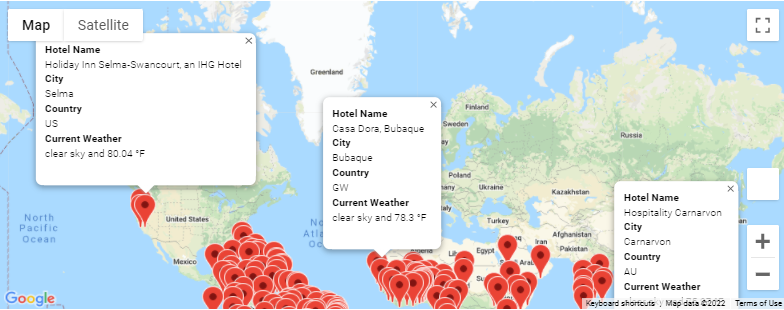
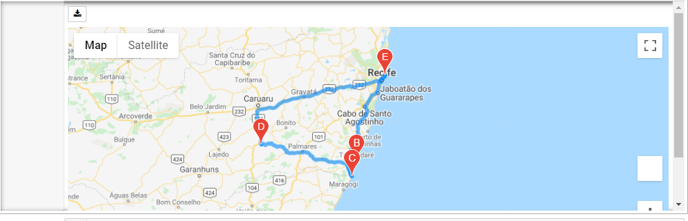
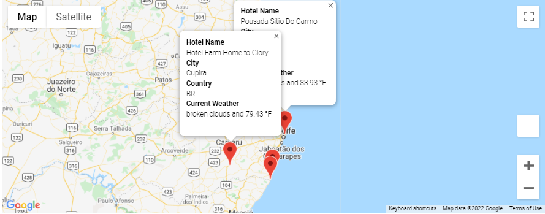

# World Weather Analysis

## Objective
From a random set of geographic coordinates we are looking to obtain possible cities that a user could choose based on temperature and geographic preferences.

## Process

### Retrieve Weather Data
1. We generated a set of 2,000 random latitudes and longitudes and we obtained the nearest city of each coordinate using the *citipy* module
2. We performed an API call with OpenWeatherMap and retrieved the following information:
   - Latitude and longitude
   - Maximum temperature
   - Percent humidity
   - Percent cloudiness
   - Wind speed
   - Weather
3. With the retrieved data we generated a CSV file with 709 cities and their respective key weather data. Please refer to the *Weather_DataBase* folder for more information.

### Create a Customer Travel Destinations Map
1. With data from the *Weather_DataBase* folder we filtered out the cities from our dataframe by using two input statements that prompt the user to enter their minimum and maximum temperature criteria for their vacation
2. We performed an API call with Google Maps and retrieved the name of a hotel in the selected cities
3. We generated map with pop-up markers for each city on the map. Each pop-up marker includes Hotel Name, City, Country Code and Current Weather Conditions. Below you will find the output of our analysis, which is also in the *Vacation_Search* folder.

### Create a Travel Itinerary Map
1. With data from the *Vacation_Search* folder we selected four cities that were close from each other in the same country, in this exercise we chose cities close to Recife, Brazil.
2. Using *gmaps* we created a direction layer map using the coordinates of the four chosen cities, in this exercise we selected 'DRIVING' mode. Below you will find the output of our analysis. 

3. We generated a map with pop-up markers for the chosen cities.Below you will find the output of our analysis.

4. For more detailed information please refer to the *Vacation_Itinerary* folder.

